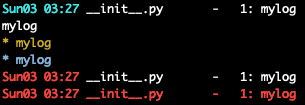

## Logging

### make sure all logging is in debug

```j.logger.debug=True```

careful: if custom configuration done before to the logger, it will be reset when calling this.

This will make sure that all logging functions are enabled on all objects in jumpscale, easy for debugging
Will also make sure redis is running for core functions

### redis

if there is a core redis then all logging will also happen to redis.
Max 2000 logentries are kept per process.

#### to listen to logs going to redis

#### how are logs stored in redis

- hset: log:$log_id:$log_prefix log_id thedata, which is msgpack

### logger prefix (FIX)

on classes who inherit from our jsbase class you can use self._logger_prefix
this prefix will then be  used for all log statements, this makes it easy to search for logs later

if not filled in then the prefix will be self._location which will give good idea where log comes from


### log impl details

### dict keys:

- processid : a string id can be a pid or any other identification of the log
- cat   : optional category for log
- level : levels see https://docs.python.org/3/library/logging.html#levels
- linenr : nr in file where log comes from
- filepath : path where the log comes from
- context : where did the message come from e.g. def name
- message : content of the message
- data : additional data e.g. stacktrace, depending context can be different
- hash: optional, 16-32 bytes unique for this message normally e.g. md5 of eg. concatenation of important fields

### LOGGING LEVELS:

- CRITICAL 	50
- ERROR 	40
- WARNING 	30
- INFO 	    20
- STDOUT 	15
- DEBUG 	10
- NOTSET 	0

### logger functions on core

```python
j.core.tools.log("mylog",cat="cat",level=10)
j.core.tools.log("mylog",cat="cat",level=15)
j.core.tools.log("mylog",cat="cat",level=20)
j.core.tools.log("mylog",cat="cat",level=30)
j.core.tools.log("mylog",cat="cat",level=40)
j.core.tools.log("mylog",cat="cat",level=50)
```
results in




## how to call logging on class

```
self._log_debug('List files in directory with path: %s' % path,_levelup=3)
```

note the _levelup argument, allows you to choose a source of code levels up, very handy for JS supporting classes. Std = 1

## logging configuration

```toml
#if debug on then will log all
DEBUG = true

LOGGER_INCLUDE = ['*']
LOGGER_EXCLUDE = ['sal.fs']
LOGGER_LEVEL = 15
# if false then will not show on console (also not in debug)
LOGGER_CONSOLE = false 
# will log to redis server
LOGGER_REDIS = true
```

when logging to redis server, consult using

```
j.clients.logger.tail()
```

will show everything going on

